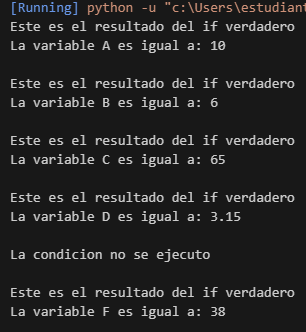

#Esta es la documentacion

Se puede observar que en los primeros 5 ejercicios se cumple la condicion, sin embargo en el penultimo la condicion no se cumple, por lo tanto aparece el mensaje "La condicion no se ejecuto"

